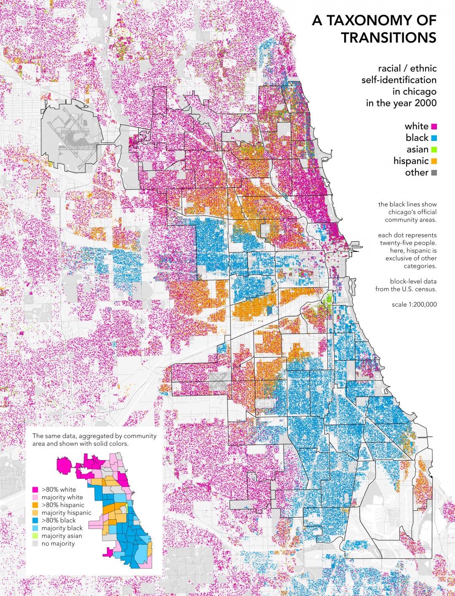

# Bias in Machine Learning Algorithms 
## Ethical Implications and Possible Countermeasures

The above video gives a rough overview of what bias in machine learning is all about: It mainly is about skewed input data which in comparison to the reality is not representative enough. The video was published in 2017 by Google. A company which has quite a history when it comes to ethical incidents related to machine learning. Back in 2015, for example, Google Photos was initially launched to categorize peoples photo libraries by applying machine learning driven image recognition models. As it turned out, most of the time pictures of black people were labeled as "gorillas" [11]. But there are not only racist biases, there are also sexist ones. In 2017 a gender bias in Google Translate was revealed. In Turkish, there is a pronoun used for the singular, gender-neutral third person. Since there is no precise English translation, Google Translate had to somehow "guess" what English pronoun to use. As it turns out, it uses "he" when the Turkish pronoun occurs alongside "doctor" or "hard working" and it uses "she" when the pronoun occurs in the same sentence as "nurse" or "lazy" [12]. However, Google definitely is not the only company struggling with bias in its algorithms. Just think about Microsoft's chatbot Tay which learned from Twitter and had to be taken offline just a day after its launch since it began spouting extremely antisemitic messages [13]. Another example would be Facebook's AI-driven, self-service platform to buy ads. In 2017, ProPublica reported that ads could be specifically targeted to people interested in topics like "How to burn jews" or "History of 'why jews ruin the world.'" According to Facebook, an algorithm was responsible for creating these categories [13] [1].

### Ethical Implications on the Example of Criminal Justice
So as stated above, biases in machine learning algorithms can result in extremely discriminating outcomes, be it in a racist, a sexist or a religious way. The mentioned examples are all bad enough, but where it becomes even worse is in the field of machine learning in the criminal justice system. For example, in the US there are systems used to evaluate recidivism rates. They assign scores indicating how likely a particular defendant will commit future crimes. The predictions of these systems are used from pre-trial release to parole and everything in between. Furthermore, in 9 out of 50 states, these scores are also provided to judges for consideration during sentencing. The predictions of these systems are based on numerous attributes like employment history, education levels and prior crimes. However, they explicitly exclude sensitive attributes like ethnicity and race [4]. So in theory they should provide objective, unbiased results, right? Unfortunately, they do not. According to an extensive investigation by ProPublica the probability for mistakenly predicting a low risk for white defendants is twice a high as the probability for mistakenly predicting a low risk for black defendants. Interestingly, it also works the other way around. The probability for mistakenly predicting a high risk for black defendants is twice a high as the probability for mistakenly predicting a high risk for white defendants, too [5].
In practice that means that black defendants will on average get harder sentences - and often times unjustifiably.

### Possible Countermeasures
As seen in the criminal justice example, probably the first thing which comes to mind when thinking about possible countermeasures to get rid of biases in machine learning, is to just remove sensible features like gender, race or religious orientation from the input datasets. It turns out, that in the physical world, this approach works quite well sometimes. E.g. in the 1970s many of the top orchestras around the world modified their auditions by putting a curtain between the jury and the person trying to get the job so that the jury was no longer able to see the musician - and implicitly not the gender of the musician. After this protocol change there were soon significantly more female concert musicians in the orchestras then before. Unfortunately, it turned out, that in the world of data it is not that easy to remove biases by applying this technique. Consider the demographical map showing the racial self-identification across chicago in the year 2000 [15].

As suggested, we remove race from our training data set. What we initially did not consider is the postal code. But when looking at the map, it is obvious, that the postal code on its own is a pretty good estimation for the race of the citizens. So the general problem is, that there may be a lot of features which are highly correlated with the features we initially called "sensitive", like for example race, gender a sexual orientation. The postal code example might be fairly simplistic, but in real data sets with hundreds of features it might not always be that obvious which features to remove in order to eliminate e.g. racist or sexist bias [2]. This is also exactly what happened in the criminal justice example mentioned above. 

When keeping in mind that most when not all of the biases in machine learning originally result from a training set which fails to represent the real world adequately - "garbage in, garbage out", another countermeasure seems pretty promising. Why not just strive for full spectrum learning sets? In fact, that is definitely one of the best approaches to prevent bias and often this is the ultimate goal. Unfortunately, AI researchers often have to deal with existing data sets and can not easily conduct their own studies to retrieve a perfectly representative training set. But of course they can choose to sample the existing data set in a variety of different ways in order to minimize bias. Consider the following - of course oversimplified - example. Suppose a researcher wants to build an image recognition model. Since he is aware of the problems concerning ethical bias, after initially training the model he decides to test his model against portraits showing people from different races. He recognizes, that the detection rate for black people is much lower than the detection rate for white people. Since the training set he uses mainly includes images taken in Europe this makes totally sense. But now he can decide either to reduce the number of portraits of white people in the training set or to gather additional portraits of black people in order to minimize the bias. 

There are also a lot of techniques to tweak specific machine learning models to strengthen them against bias, but since they are highly technical they will not be covered here.

A completely other approach towards minimizing bias comes in the form of regulations. As recent developments in Europe showed, politics finally gets aware of the various data related problems we are facing in the information age we live in. With the General Data Protection Regulation (GDPR), everytime a European company uses an algorithm to make some kind of a decision on a citizen, since 2018 the according citizen has the right to know why the algorithm decided the way it did. And even it is sometimes highly questionable, if a company can really give an exhaustive answer on why a deep learning model with hundreds of hidden layers made a specific decision, it is nevertheless a step in the right direction. Another positive aspect about the GDPR is, that it seems to prohibit the storage and use of "personal data revealing racial or ethnic origin, political opinions, religious or philosophical beliefs, or trade union membership, and the processing of genetic data, biometric data for the purpose of uniquely identifying a natural person, data concerning health or data concerning a natural person's sex life or sexual orientation" [10]. Of course there are many exceptions to this paragraph, but again, most of the ethicists think that it is definitely a move in the right direction. It remains to be hoped that other countries will follow this regulation.

### Further Reading
As a scientific entry point to the ethical debate about bias in machine learning, A. Yapo and J. Weiss did a great job with their paper "Ethical Implications Of Bias In Machine Learning" published in 2018 [4]. Another great paper worth reading is "Ethics and Bias in Machine Learning: A Technical Study of What Makes Us 'Good'" from A. Shadowen [9]. She give a gentle but scientific introduction into the ethical implications of bias in machine learning, too, but also covers the US criminal justice prediction system - mentioned above - as a case study. When diving deeper into the topic, there is no way around Kate Crawford [6]. Alongside a lot of academic publications she is also the author of the well-known New York Times article "Artificial Intelligence’s White Guy Problem" [7], in which she introduces the implications of machine learning bias to a non-technical audience. Last but not least, the "Machine Learning Ethics References" from Radamés Ajna is a really extensive, well curated and often updated resource list, which can be found on GitHub [8].

### Conclusion and Appeal

As described above, bias in machine learning can occur in a huge variety of flavors and concerns models and algorithms of every scale - no matter if it is you drawing a picture of a shoe or if it is Google trying to correctly label billions of images. As pointed out, the ethical implications of these biases can be immense. Luckily, there are some countermeasures, so regardless at what position you will find yourself in at some point of your future career, be it a designer, a developer or a CEO - be aware of the potential ethical risks when designing or working with AI algorithms to ensure that the minorities of our societies are protected from harm. But since AI will concern everybody, not just the developers engineering the core models, I want to end on a quote from a press release by the Knight Foundation: "It is imperative that AI research and development be shaped by a broad range of voices—not only by engineers and corporations, but also by social scientists, ethicists, philosophers, faith leaders, economists, lawyers and policymakers." [3]

### References

[1] https://www.techrepublic.com/article/the-10-biggest-ai-failures-of-2017/

[2] https://youtu.be/BajPM1X9KfQ

[3] https://www.knightfoundation.org/press/releases/knight-foundation-omidyar-network-and-linkedin-founder-reid-hoffman-create-27-million-fund-to-research-artificial-intelligence-for-the-public-interest

[4] https://core.ac.uk/download/pdf/143481503.pdf

[5] https://www.propublica.org/article/bias-in-criminal-risk-scores-is-mathematically-inevitable-researchers-say

[6] http://www.katecrawford.net/

[7] https://www.nytimes.com/2016/06/26/opinion/sunday/artificial-intelligences-white-guy-problem.html

[8] https://github.com/radames/Machine-Learning-Ethics-References

[9] https://academicworks.cuny.edu/cgi/viewcontent.cgi?article=1042&context=jj_etds

[10] https://advisera.com/wp-content/uploads//sites/15/2017/12/EU_GDPR_Full_Text_EN.pdf

[11] https://eu.usatoday.com/story/tech/2015/07/01/google-apologizes-after-photos-identify-black-people-as-gorillas/29567465/

[12] https://www.dailymail.co.uk/sciencetech/article-5136607/Is-Google-Translate-SEXIST.html

[13] https://qz.com/653084/microsofts-disastrous-tay-experiment-shows-the-hidden-dangers-of-ai/

[14] https://www.nytimes.com/2017/09/20/business/media/facebook-racist-ads.html

[15] https://visual.ly/node/image/54900?_w=1080

**Not cited but also interesting:**

https://medium.com/humane-ai/ethics-in-machine-learning-54a71a75875c

https://medium.com/inside-machine-learning/thoughts-on-ai-how-bias-can-shape-data-insights-and-how-to-conquer-it-c00bf1f505f8

https://thenextweb.com/artificial-intelligence/2018/09/21/artificial-intelligence-hates-the-poor-and-disenfranchised/

https://www.nature.com/articles/d41586-018-05707-8

https://qz.com/1286533/a-startup-selling-racial-profiling-software-shows-how-ai-can-be-dangerous-way-before-any-robot-apocalypse/

https://www.wired.com/story/machines-taught-by-photos-learn-a-sexist-view-of-women/

https://newrepublic.com/article/144644/turns-algorithms-racist

https://www.technologyreview.com/s/608248/biased-algorithms-are-everywhere-and-no-one-seems-to-care/

https://qz.com/1023448/if-youre-not-a-white-male-artificial-intelligences-use-in-healthcare-could-be-dangerous/

http://www.sciencemag.org/news/2017/04/even-artificial-intelligence-can-acquire-biases-against-race-and-gender

https://alex.miller.im/posts/are-we-biased-against-machines-propublica-recidivism/

http://research.google.com/bigpicture/attacking-discrimination-in-ml/

https://www.nature.com/articles/d41586-018-05469-3